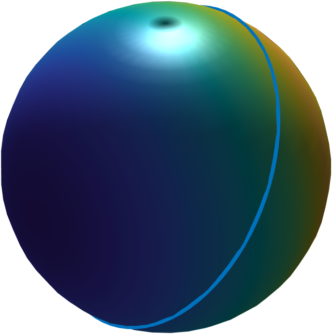
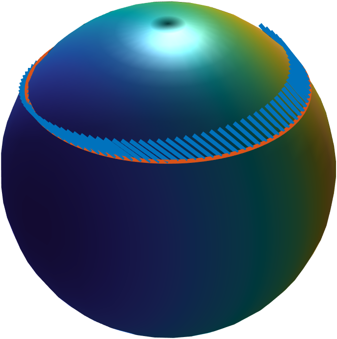
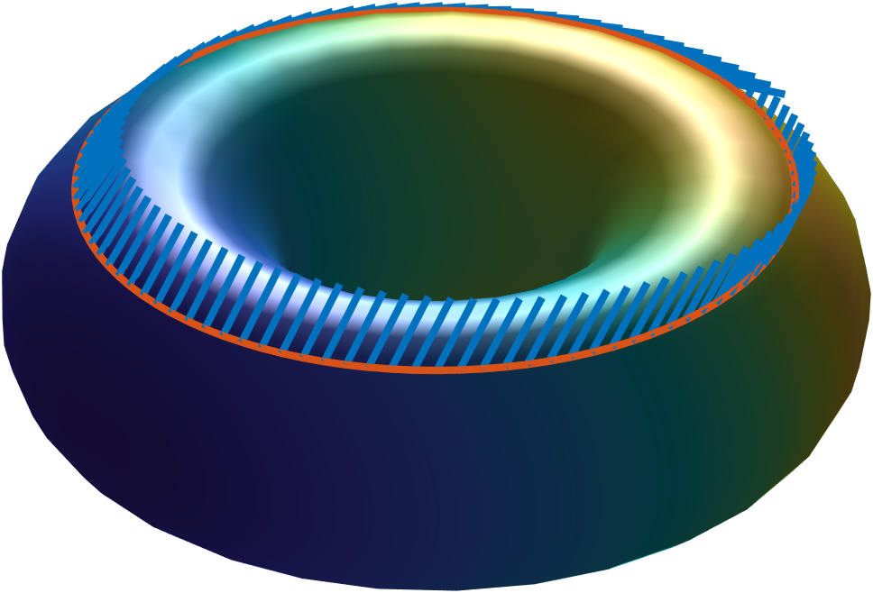
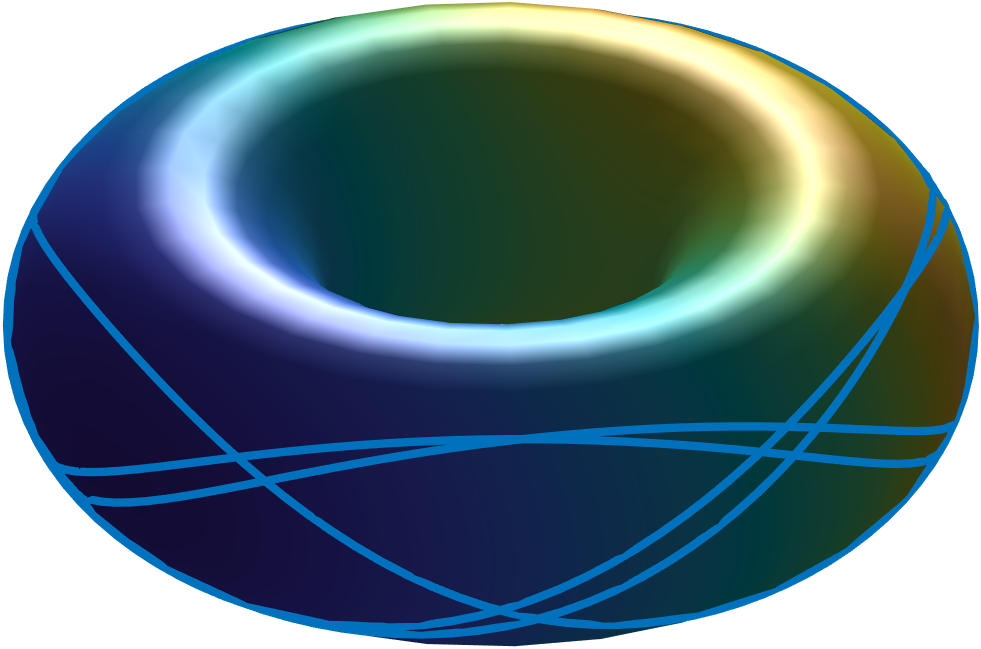
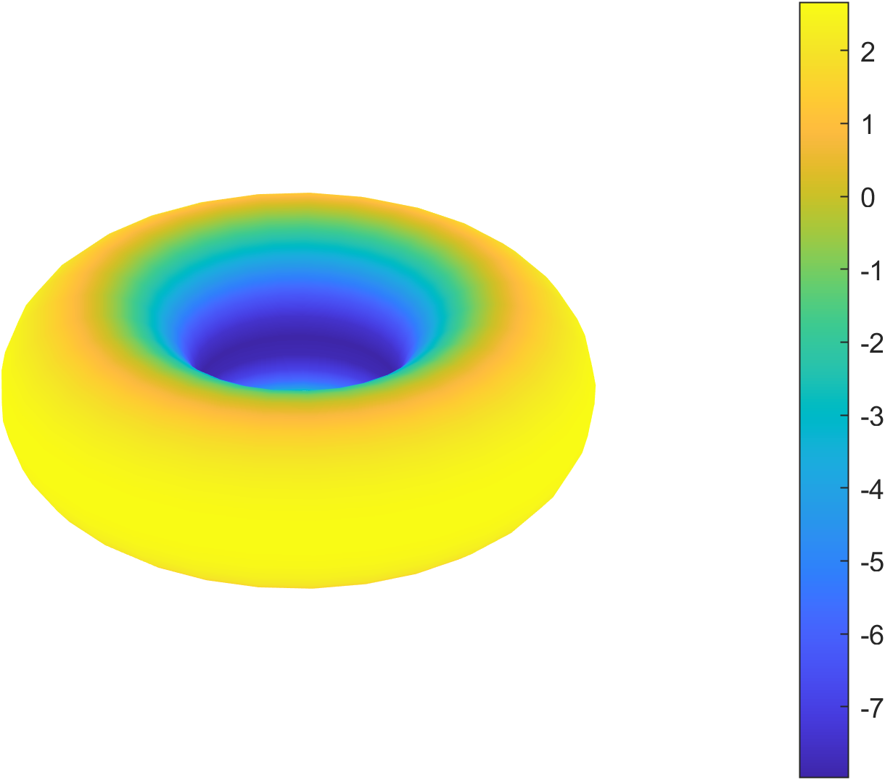
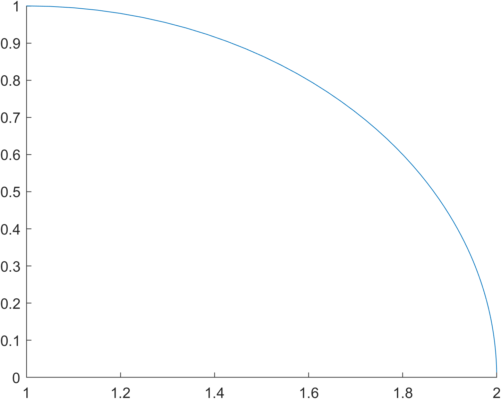

In this matlab program, you can calculate the following:

 - metric tensor
 - riemannian connection
 - riemann curvature tensor
 - ricci curvature tensor
 - scalar curvature
 - gauss Curvature
 - parallel transport
 - geodesic
 - visualization of surface
 - visualization of parallel transport
 - visualization of scalar curvature
 - visualization of geodesic

It is recommended to use the latest version of matlab

 **Input**: parametric equation
This routine will automatically calculate metrics induced by the ambient three-dimensional euclidean space.
## some sample outputs
||
|:----:|
|**sphere geodesic**|

||
|:----:|
|**sphere parallel**|

||
|:----:|
|**torus parallel**|

||
|:----:|
|**torus geodesic**|

||
|:----:|
|**torus curvature**|

||
|:----:|
|**hyperbolic parallel**|

||
|:----:|
|**hyperbolic geodesic**|

